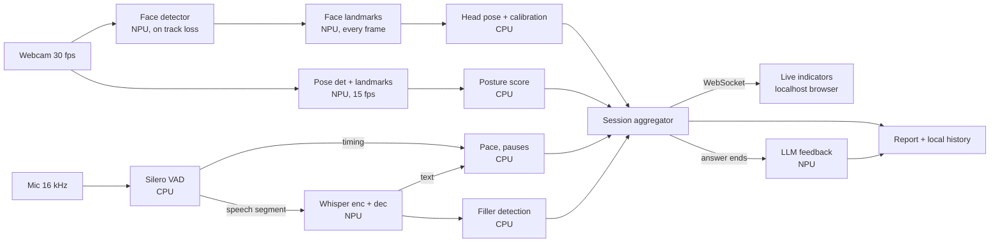

# Architecture (Day 1 draft)

| Stage | Model | Compute unit | Why |
|---|---|---|---|
| Video capture 640x480 at 30 fps | Browser getUserMedia, canvas resize, raw RGB over WebSocket | Oryon CPU | I/O. Letterbox for the detector happens in the browser canvas |
| Face detection | mediapipe_face detector | Hexagon NPU | Rerun only when landmark confidence drops. Track from previous landmarks otherwise |
| Face landmarks | mediapipe_face landmark | Hexagon NPU | Every frame. Eye contact is the headline indicator |
| Head pose and eye contact | Kabsch alignment on 3D landmarks (numpy SVD) | Oryon CPU | A few microseconds of math. NPU dispatch would cost more than the work |
| Posture | mediapipe_pose detector and landmark | Hexagon NPU | 15 fps is enough because posture changes slowly. Frees NPU time for Whisper |
| Audio capture 16 kHz | sounddevice | Oryon CPU | I/O |
| VAD | Silero VAD (ONNX) | Oryon CPU | Tiny stateful model on 32 ms chunks. Work per chunk is smaller than NPU call overhead |
| ASR | Whisper (choice pending) | Hexagon NPU | Once per VAD segment. VAD owns all timing, Whisper supplies text |
| Metrics | WPM, fillers, pauses, timelines | Oryon CPU | Rules |
| Content feedback | Small LLM (path pending) | Hexagon NPU | After the answer ends, never during live inference |
| UI | FastAPI and WebSocket to localhost browser | Oryon CPU | Accessibility from the browser |

## Open questions

- NPU contention between Whisper and vision graphs: not yet validated on device
- Eye contact vs camera or screen: pending Task C result
- Whisper model choice: pending Task B result
- QNN runtime version: wheel bundles QAIRT 2.50.40, AI Hub context binaries built with 2.50.0. Load compatibility not yet validated on device.
- Planned load order per model: precompiled context, then plain ONNX via QNN with on-device compile and context caching, then CPU with a visible notice. Not yet validated on device.
- Vision CPU preprocessing (ROI warp) exceeds model time on local x86 CPU. Optimization planned for Day 2.
